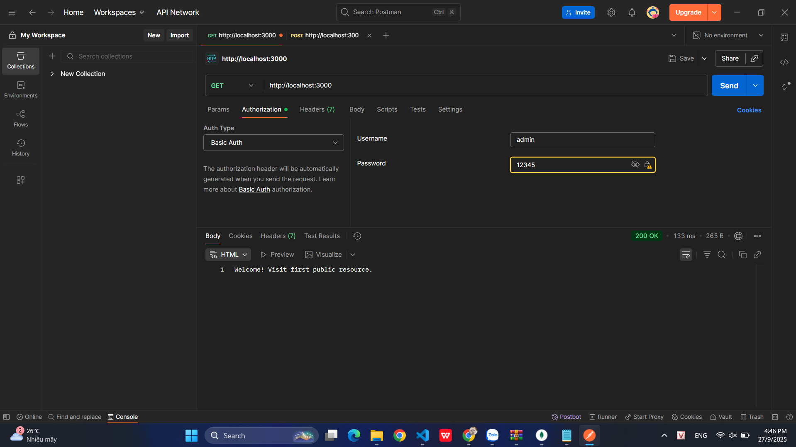
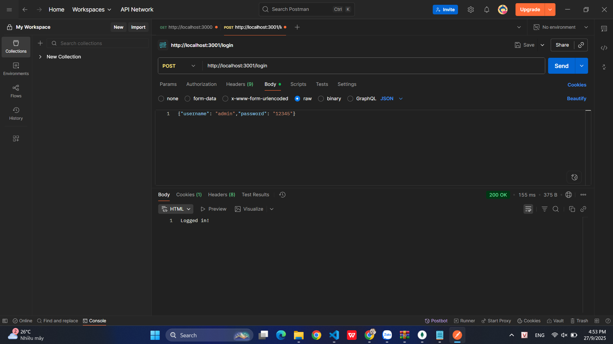
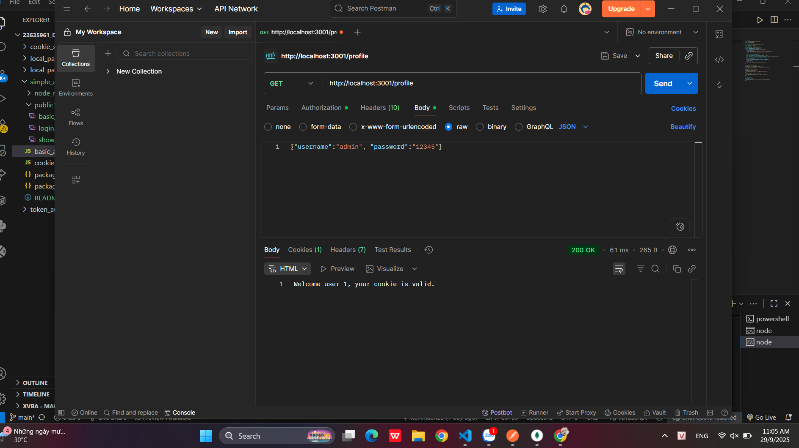
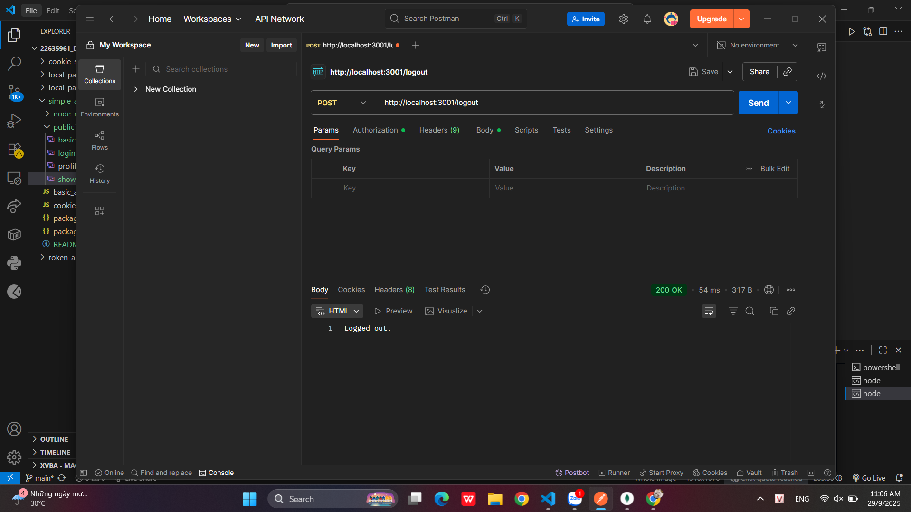
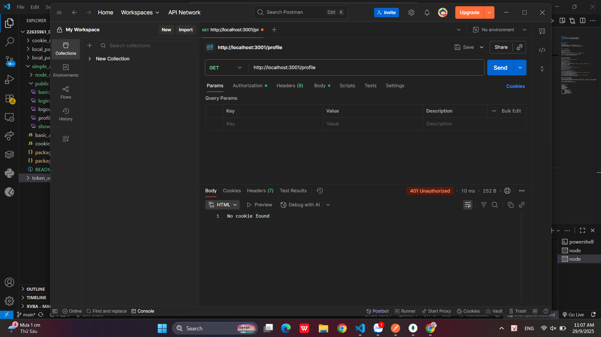
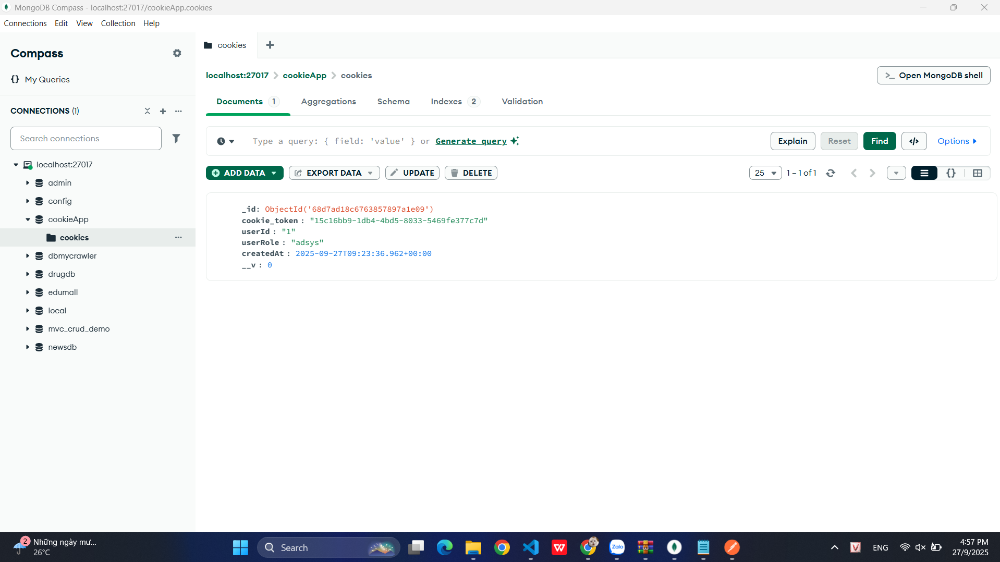

# Simple Auth

Dự án này minh họa **2 cách xác thực cơ bản trong Node.js**:
1. **Basic Authentication** (dùng Authorization Header).
2. **Cookie Authentication** (lưu cookie trong MongoDB).

---

---

## 1. Cách chạy project

| Bước | Code |
|------|------|
| Cài thư viện cần thiết | cmd->```npm install``` -> ```npm install express body-parser cookie-parser mongoose```|
| Chạy server với Basic Auth | cmd->```node basic_auth.js``` |
| Chạy server với Cookie Auth | cmd->```node cookie_auth.js``` |

---

## 2. Test bằng Postman

### 2.1. Basic Authentication
| Mô tả | Code / Thiết lập |
|-------|------------------|
| Method | `GET` |
| URL | `http://localhost:3000` |
| Authorization | Basic Auth <br> Username: `admin` <br> Password: `12345` |

**Kết quả**: Nếu đúng sẽ trả về thông báo xác thực thành công. 


---

### 2.2. Cookie Authentication
| Mô tả | Code / Thiết lập |
|-------|------------------|
| Chạy server | cmd->``` node cookie_auth.js``` |

#### a. Đăng nhập (Login)
| Mô tả | Code / Thiết lập |
|-------|------------------|
| Method | `POST` |
| URL | `http://localhost:3001/login` |
| Body (JSON) | cmd->```{"username": "admin",  "password":"12345"}``` |
#### b. Đăng xuất (Logout)
| Mô tả | Code / Thiết lập |
|-------|------------------|
| Method | `POST` |
| URL | `http://localhost:3001/logout` |
#### c. Kiểm tra cookie khi login và khi logout (profile)
| Mô tả | Code / Thiết lập |
|-------|------------------|
| Method | `GET` |
| URL | `http://localhost:3001/profile` |

**Kết quả login**: Server trả về `"Logged in!"`  

**Kết quả profile khi còn login**: Server trả về `"Welcome user 1, your cookie is valid."`  

**Kết quả logout**: Server trả về `"Logged out."`  

**Kết quả profile khi logout**: Server trả về `"Welcome user 1, your cookie is valid."`  

---

#### b. Xem cookie trong MongoDB
| Mô tả | Ví dụ dữ liệu trong DB |
|-------|-------------------------|
| Sau khi login, cookie sẽ được lưu trong collection `cookieApp.cookies` | ```"-id": "ObjectID('68d7ad18c6763857897a1e09')",  "cookie_token": "15c16bb9-1db4-4bd5-8033-5469fe377c7d",  "userId": "1",<br>  "userRole": "adsys",  "createdAt": "2025-09-27T09:23:36.962+00:00",<br>  "__v": "0"``` |

**Ảnh show Cookie trong MongoDB**: 


---

## 3. Cấu trúc thư mục
```plaintext
simple_auth/
 ├── basic_auth.js
 ├── cookie_auth.js
 ├── package-lock.json
 ├── package.json
 ├── public/
 │    └── results/
 │         ├── basic_auth.png
 │         ├── login.png
 │         ├── logout.png
 │         ├── profile_login.png
 │         ├── profile_logout.png
 |         └── show_cookie.png
 └── README.md
```
## Credit


This project was created by [Kevinkien25](https://github.com/Kevinkien25)